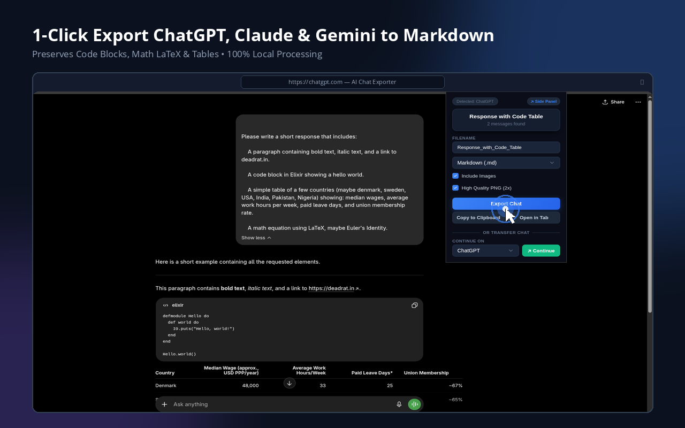

# AI Chat Exporter

A simple, privacy-focused browser extension to export AI chats from ChatGPT, Claude, Gemini, Google Search AI, Google Cloud Assist, Google AI Studio, Microsoft Copilot, NotebookLM, Perplexity, DeepSeek, Meta AI, Qwen, Mistral, Proton Lumo, and Z.ai to Markdown, JSON, HTML, PDF, Microsoft Word (.doc), or PNG image.

### Quick Install

- 🦊 **Firefox**: [Install from Firefox Add-ons](https://addons.mozilla.org/en-US/firefox/addon/ai-chat-export/)
- 🌐 **Chrome**: [Install from Chrome Web Store](https://chrome.google.com/webstore/detail/cgakhbhkplndjjknhgegfcipffflcaoj)
- 🌊 **Edge**: [Install from Microsoft Edge Add-ons](https://microsoftedge.microsoft.com/addons/detail/ai-chat-exporter-free-/hbgckjgfhnaedlihmkogenclfcnobicg)

> [!NOTE]
> Extension updates on Chrome/Edge Web Store may lag behind Firefox / GitHub releases due to long store review queues.

<b>📦 Manual / Unpacked Installation</b>

#### Chrome / Edge / Chromium

1. Download the latest `ai-chat-exporter-chromium.zip` from the [Releases page](https://github.com/Rat-S/ai-chat-exporter/releases).
2. Extract the zip file to a folder on your computer.
3. Open your browser and navigate to `chrome://extensions/` (or `edge://extensions/`).
4. Enable **Developer mode** using the toggle switch.
5. Click **Load unpacked** and select the extracted folder.

#### Firefox

1. Download the latest `ai-chat-exporter-firefox.zip` from the [Releases page](https://github.com/Rat-S/ai-chat-exporter/releases).
2. Extract the zip file to a folder on your computer.
3. Open Firefox and navigate to `about:debugging#/runtime/this-firefox`.
4. Click **Load Temporary Add-on...**
5. Select `manifest.json` inside the extracted folder.

---

## Features

- **Privacy First**: All processing happens locally in your browser. No data is ever sent to third-party servers.
- **Multi-Platform Support**: Works with many major AI chat platforms:
  - [ChatGPT](https://chatgpt.com/?q=Please%20review%20this%20FOSS%20project%20https%3A%2F%2Fgithub.com%2FRat-S%2Fai-chat-exporter%20and%20tell%20me%20what%20problem%20it%20solves%2C%20who%20it%20is%20for%2C%20its%20strongest%20features%2C%20its%20main%20limitations%2C%20and%20whether%20you%20would%20recommend%20it.)
  - [Claude](https://claude.ai/new?q=Please%20review%20this%20FOSS%20project%20https%3A%2F%2Fgithub.com%2FRat-S%2Fai-chat-exporter%20and%20tell%20me%20what%20problem%20it%20solves%2C%20who%20it%20is%20for%2C%20its%20strongest%20features%2C%20its%20main%20limitations%2C%20and%20whether%20you%20would%20recommend%20it.)
  - [Google Search AI](https://www.google.com/search?udm=50&q=Please%20review%20this%20FOSS%20project%20https%3A%2F%2Fgithub.com%2FRat-S%2Fai-chat-exporter%20and%20tell%20me%20what%20problem%20it%20solves%2C%20who%20it%20is%20for%2C%20its%20strongest%20features%2C%20its%20main%20limitations%2C%20and%20whether%20you%20would%20recommend%20it.)
  - [Microsoft Copilot](https://www.bing.com/copilotsearch?q=Please%20review%20this%20FOSS%20project%20https%3A%2F%2Fgithub.com%2FRat-S%2Fai-chat-exporter%20and%20tell%20me%20what%20problem%20it%20solves%2C%20who%20it%20is%20for%2C%20its%20strongest%20features%2C%20its%20main%20limitations%2C%20and%20whether%20you%20would%20recommend%20it.)
  - [Perplexity](https://www.perplexity.ai/search?q=Please%20review%20this%20FOSS%20project%20https%3A%2F%2Fgithub.com%2FRat-S%2Fai-chat-exporter%20and%20tell%20me%20what%20problem%20it%20solves%2C%20who%20it%20is%20for%2C%20its%20strongest%20features%2C%20its%20main%20limitations%2C%20and%20whether%20you%20would%20recommend%20it.)
  - [Meta AI](https://www.meta.ai/?prompt=Please%20review%20this%20FOSS%20project%20https%3A%2F%2Fgithub.com%2FRat-S%2Fai-chat-exporter%20and%20tell%20me%20what%20problem%20it%20solves%2C%20who%20it%20is%20for%2C%20its%20strongest%20features%2C%20its%20main%20limitations%2C%20and%20whether%20you%20would%20recommend%20it.)
  - Gemini
  - Google Cloud Assist
  - Google AI Studio
  - NotebookLM
  - DeepSeek
  - Qwen
  - Z.ai
  - Mistral
  - Proton Lumo

- **Versatile Export Formats**:
  - **Clean Markdown**: Properly formatted with code blocks, tables, and images preserved.
  - **Structured JSON**: Normalized JSON exports matching a strict JSON schema.
  - **Raw HTML**: Complete chat layout with math equations.
  - **PDF Document**: Print or save chat threads as PDF using browser native print.
  - **Microsoft Word (.doc)**: Export formatted chat documents ready to open in Microsoft Word.
  - **Shareable Image (PNG)**: Convert the chat thread into a clean, sharing-ready PNG image using `html2canvas`.
- **Chat Continuation & Obsidian Transfer**: Move your active chat context directly across platforms (e.g. send your current Claude conversation straight to Gemini, ChatGPT, or open directly in **Obsidian** via `obsidian://new` URIs).
- **Clipboard Rich-Text Copying**: Instantly copy chats to your clipboard with rich-text formatting, perfect for pasting directly into emails, document editors, or notes.
- **Side Panel Support (Chromium Only)**: View exports and run chat context continuation inside your browser's native side panel for a streamlined workflow.
- **Custom Filenames**: Input custom filenames before exporting to keep your downloads structured.
- **One-Click Export**: Quick popup interface for fast exports.

## Usage

1. Navigate to any supported AI chat platform
2. Click the AI Chat Exporter icon in your browser toolbar
3. Choose Markdown or JSON, then click "Export Chat" to download the file
4. The file is saved to your Downloads folder with a timestamped filename

## Development

For setup, building from source, and details on project structure, please refer to the [Development Guide](DEVELOPMENT.md).

## Privacy

AI Chat Exporter does not collect, store, or transmit any personal data.
See the full [Privacy Policy](https://ai-chat-exporter.covai.org/privacy.html) for details.

## License

This Source Code Form is subject to the terms of the Mozilla Public License,
v. 2.0. See [LICENSE](LICENSE) for the full license text.

## Contributing

Contributions are welcome! Please feel free to submit issues or pull requests.

## Acknowledgments

- Uses [Turndown.js](https://github.com/mixmark-io/turndown) for HTML to Markdown conversion.
- Uses [DOMPurify](https://github.com/cure53/DOMPurify) for HTML content sanitization and security.
- Uses [html2canvas](https://github.com/niklasvh/html2canvas) for generating shareable PNG image exports.
- Uses [KaTeX](https://github.com/KaTeX/KaTeX) for rendering math and LaTeX equations.
- Uses [Prism.js](https://github.com/PrismJS/prism) for code block syntax highlighting.
- Built with [WXT](https://wxt.dev/) extension development framework.

---

> **Nota bene:** This extension was developed for personal use and may not be very polished. I release it with the hope that it can be useful to others. Additionally, formatting of exported items from certain chats may currently not work well due to changes in those chat platforms. You are welcome to submit an issue or PR.

_Note: Feedback and issue reports are very welcome — feel free to submit [Feedback / Issue Reports](https://ai-chat-exporter.covai.org/feedback.html) or open a [GitHub Issue](https://github.com/Rat-S/ai-chat-exporter/issues)._
